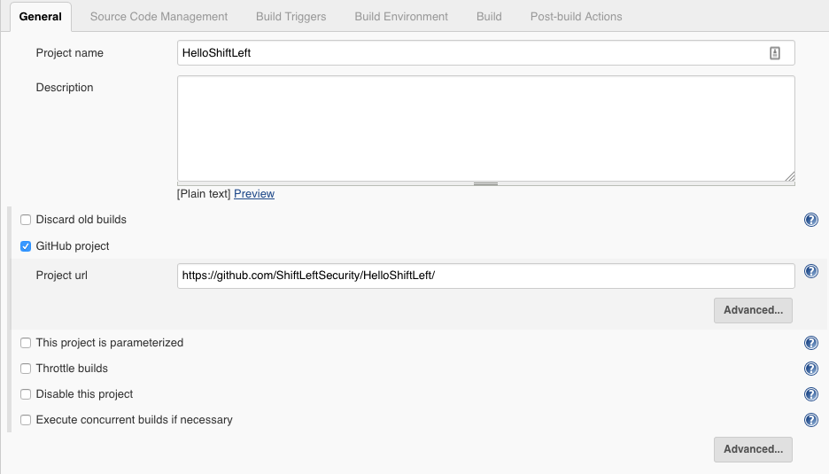
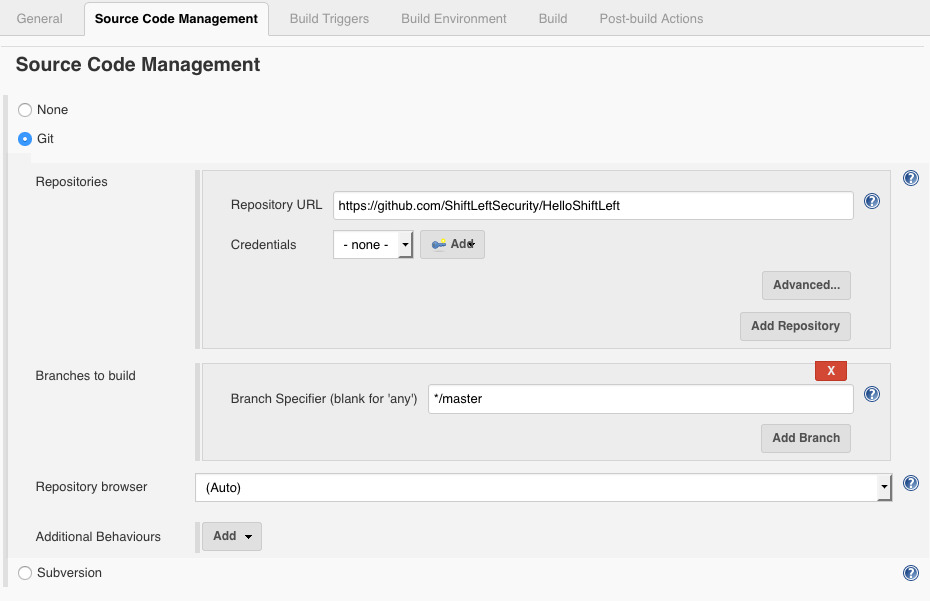
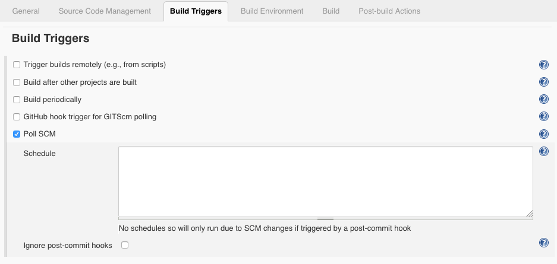
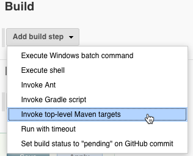
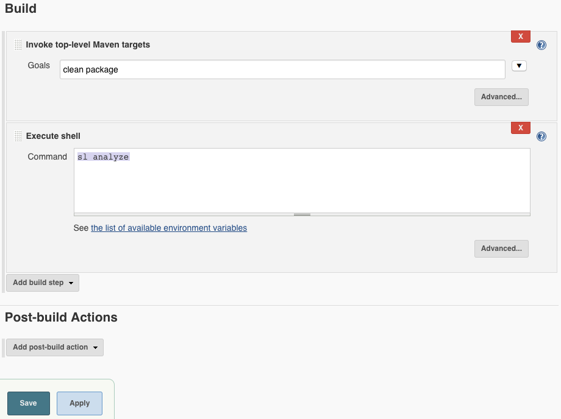
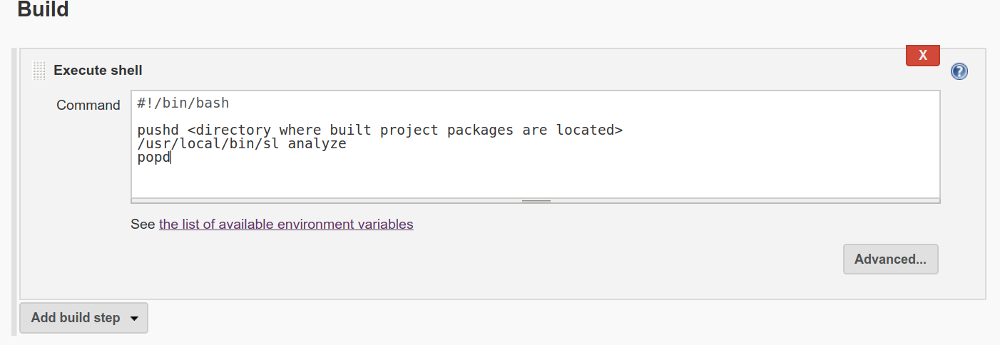

# Configure Final Build Step

The instructions for integrating ShiftLeft with Jenkins using a final build step differ depending on the type of Jenkins project you are configuring: Freestyle or Pipeline.

## Prerequisites

1. Review [Jenkins requirements](integrating-jenkins-builds.md).
2. [Install the ShiftLeft CLI](../getting-started/using-sl-the-shiftleft-cli.md) on the host where Jenkins is installed.
3. Create Jenkins environment variables to [authenticate](../getting-started/authenticating-with-shiftleft.md) with ShiftLeft and associate Jenkins builds with your ShiftLeft tenant. 

## Freestyle Project Configuration

To integrate the `sl analyze` (or `sl analyze --cpg`) shell command as a build step in a Jenkins Freestyle project:

1. Log in to the Jenkins Dashboard (Home screen).
2. Create a new Java freestyle project in Jenkins, or edit an existing Java freestyle project.
3. Configure the freestyle project as shown in the screenshots below. 
Note that this is an example freestyle project configuration using the [HelloShiftLeft](https://github.com/ShiftLeftSecurity/HelloShiftLeft) sample app; your Jenkins freestyle project configuration may differ.








4. In the **Build** section of the project configuration, click **Add build step**. 
5. Select the build step corresponding to the build tool you are using (Maven or Gradle). 
For example, if you are using Maven, select **Invoke top-level Maven targets**.



6. Enter the **Goals** for the Maven or Gradle build step you are configuring. 
For example, if you are using Maven, enter `clean package`.


7. Click **Add build step** to add another build step.
8. Select the **Execute Shell** option.
9. Add the `sl analyze` command as shown below (or `sl analyze --cpg` if you prefer).
You must ensure that this step is configured to be the final build step. If necessary, drag the action window to the end of the build configuration section.
10. Click **Save** when you are done.



The above shell command assumes that the SL CLI is in your `$PATH`. If it is **NOT**, either put it there (recommended), or use the following command to invoke `sl analyze`:

```bash
#!/bin/bash

pushd <directory where built project packages are located>
/usr/local/bin/sl analyze
popd
```

For example:




## Pipeline Project Configuration

To  integrate the `sl analyze` (or `sl analyze --cpg`) shell command as a final build step in a Jenkins Pipeline project (using a Jenkinsfile):

1. Complete [Jenkins prerequisites](#prerequisites).
2. Edit the Jenkinsfile and add a final stage at the end of the build stage. For example:

```groovy
stage('SLAnalyze') {
    dir("/directory/where/built/project/packages/are/located") {
        sh '/usr/local/bin/sl analyze'
    }
}
```
