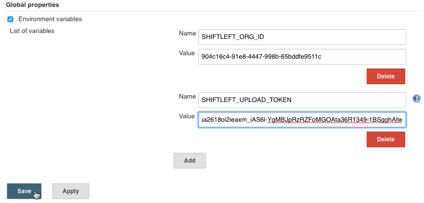

# Integrating Jenkins Builds

To integrate Jenkins builds with ShiftLeft and automate code analysis, configure each Jenkins project to execute the `sl analyze` (or `sl analyze --cpg)` shell command.

## Jenkins Integration Options

There are **two ways** to integrate with Jenkins: by configuring a [final build step](doc:jenkins-final-build-step) or [post build task](doc:jenkins-post-build-task) for *each* Jenkins project you want to submit for analysis to ShiftLeft.

Configuration Option | Description
--- | ---
[Final Build Step](doc:jenkins-final-build-step) | Edit the project build configuration and add the `sl analyze` (or `sl analyze --cpg)` shell command as a [final build step](doc:jenkins-final-build-step).
[Post Build Task](doc:jenkins-post-build-task) | Install the *Hudson Post Build Task Plugin* plugin and add the `sl analyze` (or `sl analyze --cpg)` shell command as a [post build task](doc:jenkins-post-build-task).

## Jenkins Integration Prerequisites

The requirements for integrating Jenkins application builds are as follows:

- [Jenkins installation](https://jenkins.io/changelog/) version 2.78 or later
- Supported application and build tool (see [code analysis requirements](doc:requirements#section-code-analysis-requirements))
- Familiarity with [ShiftLeft Workflow](doc:getting-started#section-shiftleft-workflow) 
- ShiftLeft account credentials: **Organization ID** and **Upload Token**
Initially these credentials will be provided to you by ShiftLeft. Once you have established your account you can copy them from the **My Profile** page at the ShiftLeft Dashboard.

## Jenkins Integration Instructions

1. [Install the ShiftLeft CLI](doc:cli#section-installation) on the host where Jenkins is installed.
2. Log in to Jenkins as an administrator.
3. Select **Manage Jenkins > Configure System > Global properties**. 
4. Select (check) **Environment variables** and create the following:
  * Name: `SHIFTLEFT_ORG_ID`| Value: Paste your **Organization ID**
  * Name: `SHIFTLEFT_UPLOAD_TOKEN`| Value: Paste your **Upload Token**

  

5. Configure each Jenkins project you want to [analyze](doc:analyze) using one of the following approaches: 
 * [Final Build Step](doc:jenkins-final-build-step), or
 * [Post Build Task](doc:jenkins-post-build-task)
6. Test and [verify Jenkins integration](doc:jenkins-verify).

For basic Jenkins administration you can set and inject build env vars as described above. For advanced Jenkins administration, you can use Jenkins secret store to inject the ShiftLeft credentials into builds. Refer to the [Jenkins documentation](https://jenkins.io/doc/) for details.

## Jenkins Integration Demo

Here is a quick video (~ 2 minutes) that demonstrates how to integrate ShiftLeft with an existing Jenkins freestyle project using the [final build step](doc:jenkins-final-build-step) approach: https://youtu.be/bI1GATsD5mc.
