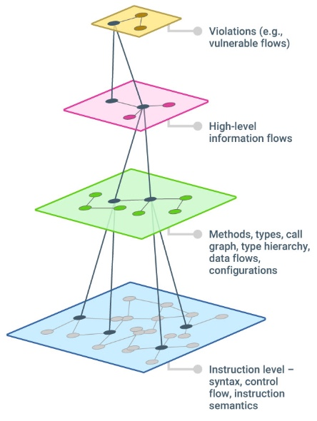

# Understanding the Code Property Graph (CPG)

All ShiftLeft solutions leverage the CPG. Based on your application code, in the form of either a JAR for Java or as source code for C/C++, ShiftLeft generates a a Code Property Graph (CPG) that can be used as the basis of custom static analysis. The CPG provides an extensible, multi-layered representation of each unique code version, including the various levels of abstraction—all presented in a single graph, across multiple programming languages. CPGs are serializable to various output/exchange formats such as CSV, GraphML, Gryo,and Protobu.

The CPG is essentially a “graph of graphs”, depicting control flow graphs, call graphs, program dependency graphs and directory structures. The CPG creates a multi-layered, three-dimensional representation of your code, with unprecedented insights that enable code developers and analysts to fundamentally understand what each version of their application is able to perform and not perform, and any scenarios that may pose a risk.

For ShiftLeft Ocular users, additional information on the CPG is provided:

* [Creating the CPG](../using-ocular/getting-started/create-cpg.md)
* [Working with CPGs](../using-ocular/getting-started/working-with-cpg.md)
* [Deep-Dive: The CPG](../using-ocular/about/cpg-deep-dive.md)

## Multi-Layered Semantic Graph

The CPG takes the graphs you have named and merges them into a joint data structure. The result is a multi-layered, three-dimensional representation of code, delivering unprecedented code insight. The CPG displays information flows in the context of what the application fundamentally is and is not supposed to do. From this perspective, vulnerabilities become easier to identify as anomalies. The CPG leverages semantic graphing to create a single multi-layered graph, thereby summarizing all the components and flows in each version of the code. 

The CPG maps all of the code elements (custom code, open-source libraries, and commercial SDKs) into various levels of abstraction, including abstract syntax trees, control flow graphs, call graphs, program dependency graphs, and directory structures. This joint data structure provides a much deeper understanding of how the various components interact with each other. This understanding also enables a more effective analysis of the code for the identification of vulnerabilities. This is especially effective for identifying complex vulnerabilities made up of a series of conditions and across a number of components in the code that are simply impossible to discover using legacy SAST tools.

## Insights from the CPG

The unique insights from the CPG provide all ShiftLeft solutions with granular detail and a deep understanding of data flows. CPG mapping includes traversals within the various layers of code to rapidly identify 

* Sources of data leakage
* Critical vulnerabilities
* Security/compliance violations 

early and across the entire software development lifecycle (SDLC): from development to production. With this optimized view, both false positives and false negatives are greatly reduced, providing a high-level of accuracy at unprecedented speed and scale.
