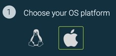

# Quick Start for ShiftLeft Inspect and ShiftLeft Protect

You use ShiftLeft Inspect to analyze your application for vulnerabilities, and ShiftLeft Protect to monitor and protect your application at runtime. To use ShiftLeft, you need:

* A ShiftLeft Account ([contact us](https://www.shiftleft.io/contact/)).
* All [ShiftLeft requirements](../introduction/requirements.md).
* An application you want to analyze and protect. 

The Quick Start process if different depending on whether you are using the [Linux and MacOS X](#quick-start-on-linux-and-macos-x) or [Windows](#quick-start-on-windows) operating systems.

## Quick Start on Linux and MacOS X

You can use the [HelloShiftLeft](../introduction/helloshiftleft.md) sample application to learn how to use ShiftLeft.

This information parallels and provides additional details on the [Welcome page](https://www.shiftleft.io/dashboard) that you use the first time you log into ShiftLeft.
   
The process for quickly starting with ShiftLeft Inspect and ShiftLeft Protect on Linux and MacOS X is:

1. [Choose your operating system](../introduction/support.md).

   

2. [Install the ShiftLeft Command Line Interface (CLI)](using-cli/install-cli.md).

3. [Authenticate with ShiftLeft](using-cli/authenticating.md).

4. [Use ShiftLeft Inspect](inspect/analyzing-applications.md) to analyze your code.

5. [Implement ShiftLeft Protect](protect/implement-protect.md) to secure your application.

## Quick Start on Windows

The process for quickly starting with ShiftLeft Inspect and ShiftLeft Protect on Windows is:

1. [Install ShiftLeft for Windows](windows-installer.md). The Windows installer automatically installs the ShiftLeft Command Line Interface (CLI).

2. [Authenticate with ShiftLeft](using-cli/authenticating.md).

3. [Use ShiftLeft Inspect](inspect/analyzing-applications.md) to analyze your code.

4. [Run ShiftLeft Protect](protect/run-protect.md) to secure your application.
