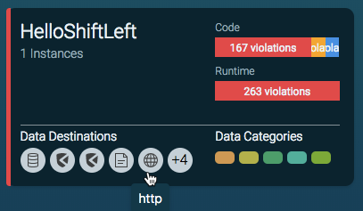
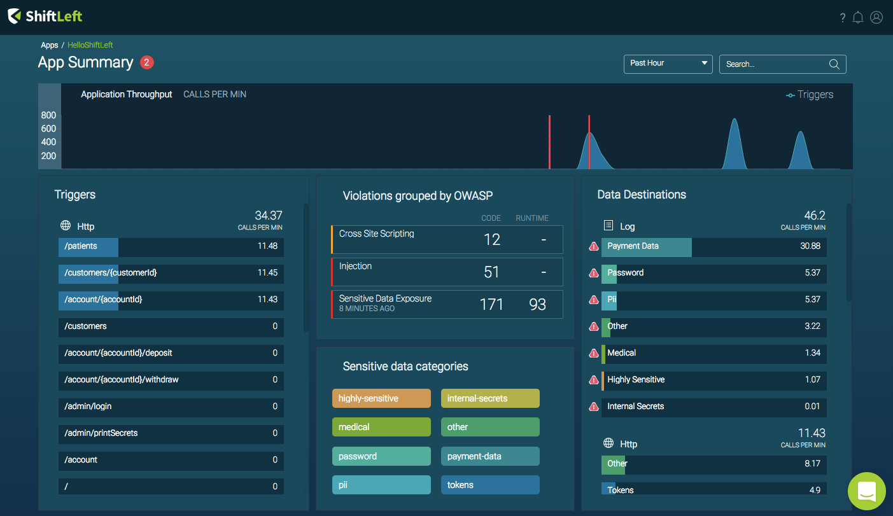

## Strictness

The strictness setting determines how the Microagent behaves if there is a disconnection between it and the proxy server. The ShiftLeft Protect for Java Microagent runs in two modes: non-strict (default) and strict.

In non-strict mode (default), the Microagent does not require the SPR at startup. In this case the app starts but may not be monitored by ShiftLeft, or in case it is, metrics generated during disconnection are ignored.

In strict mode (`"strict":"true"`) the Microagent requires the SPR to let the application run. If the Microagent loses connection with the proxy, the application methods calling the proxy are paused until connection is reestablished.

Parameter | Name
--- | ---
JSON | `strict`
JVM | `-Dshiftleft.strict`
Environment Variable | `SHIFTLEFT_STRICT`

### Strictness Values

- `false` (default): Proxy availability is not required. Event notifications can be lost and the application can run without instrumentation (if the proxy did not respond with the SPR at startup).
- `true`: Agent pauses the execution of the program until connection with the proxy is established and the SPR is passed to the Microagent.

The default strictness mode is false.

## Logging

This section describes configuration options for logging Microagent activity.

### Log Levels

Log level determines the level of detail that the Microagent logger outputs.

Parameter | Name
--- | ---
JSON | `log.level`
JVM | `-Dshiftleft.log.level`
Environment Variable | `SHIFTLEFT_LOG_LEVEL`

**Log Level Values** (from most to least logging information)
- `TRACE`: Finest level. Useful for technical debugging. Not for use in production environments.
- `DEBUG`: Detailed level. Useful for debugging. Not for use in production environments.
- `INFO`: Reasonable informative level. Returns information relevant to the user.
- `WARNING`: Warning informative level.
- `ERROR`: Show only errors.
- `QUIET`: (default) Does not create a log file. Logging is redirected to the app `stderr`.

### Log Files

Used to write logs to file system. Denotes the file name pattern for a rolling set of logs files. If not specified, Microagent logs are redirected to target application `stderr`.

Parameter | Name
--- | ---
JSON | `log.file`
JVM | `-Dshiftleft.log.file`
Environment Variable | `SHIFTLEFT_LOG_FILE`

### Rolling Log Files

Number of files to use in the rolling file set. Only used if logging to file system.

Parameter | Name
--- | ---
JSON | `log.maxFiles`
JVM | `-Dshiftleft.log.max.files`
Environment Variable | `SHIFTLEFT_LOG_MAX_FILES`

### Log File Size

Size limit per log file, in bytes. Only used if logging to file system.

Parameter | Name
--- | ---
JSON | `log.maxFileBytes`
JVM | `-Dshiftleft.log.max.file.bytes`
Environment Variable | `SHIFTLEFT_LOG_MAX_FILE_BYTES`

## Security

This section contains configuration parameters relative to the detection and blocking capabilities of the Microagent.

### Mode

Security mode that determines how the Microagent respond to attacks (malicious external payloads).

Parameter | Name
--- | ---
JSON | `sec.mode`
JVM | `-Dshiftleft.sec.mode`
Environment Variable | `SHIFTLEFT_SEC_MODE`

Values:
- `REPORT`(default): Do not alter application behavior, just report the detected attacks
- `BLOCK`: Block application execution when attacks are found, by throwing a java.lang.SecurityException, and report the attack

### XXE

Type of protection to adopt when parsing XML documents of non trusted origin.

Parameter | Name
--- | ---
JSON | `sec.xxe`
JVM | `-Dshiftleft.sec.xxe`
Environment Variable | `SHIFTLEFT_SEC_XXE`

Values:
  - `OFF`: No XXE protection (default)
  - `DTD`: Disable DTDs completely. Almost all XML entity attacks are prevented including denial of services (DOS) attacks such as Billion Laughs.
  - `EXTERNAL`: Disable only external DTDs and entities. This protects against XXE attacks but not against denial of services (DOS) attacks such as Billion Laughs.

### Collect Attack Information

Enables collecting full payloads of attack events. This might include sensitive information, which is stored encrypted. Disabled by default.

Parameter | Name
--- | ---
JSON | `sec.collect.attack.info`
JVM | `-Dshiftleft.sec.collect.attack.info`
Environment Variable | `SHIFTLEFT_SEC_COLLECT_ATTACK_INFO`

 Values:
  - `true`: Attack payloads are collected and sent to ShiftLeft's infrastructure for viewing in the [Vulnerability Dashboard Event Viewer](../../../using-inspect-protect/using-workflow/vulnerability-dashboard.md#event-details).
  - `false`: (default)

## HTTPS Proxy Configuration

The ShiftLeft Protect for Java Microagent supports the commonly used environment variable `https_proxy` for configuring a HTTPS proxy.

```bash
export https_proxy="http://[$user:$password@]$host:$port"
```
## Analyzing the Application

Before running the Microagent, analysis of the target application using ShiftLeft Inspect must be performed. This allows ShiftLeft Protect to generate instrumentation custom tailored to the specific version of the application.

Analysis can be performed either as a separate step, allowing installation in a build / Continuous Integration (CI) environment, or in the same command used to run ShiftLeft Protect.

### Analyzing as a Separate Step

When you analyze your application as a seperate step before using ShiftLeft Protect, you must include the `shiftleft.json` file (generated by ShiftLeft Inspect) with the target application you are deploying. Doing so allows the Microagent to associate the application to be run with the analysis.

Refer to [Analyzing Applications](../../../using-inspect-protect/inspect/analyzing-applications.md) for information on using ShiftLeft Inspect to analyze your application.

#### The `shiftleft.json` File

The `shiftleft.json` file generated by ShiftLeft Inspect contains the Access Token and SPR ID. These required parameters  must be passed to the Microagent.

By default, the Microagent expects the `shiftleft.json` file to be in the working directory from which you run your  application. If you are running the application in a different environment different, copy `shiftleft.json` to the working directory of that environment. 

Alternatively you can set the `SHIFTLEFT_CONFIG` environment variable to point to the path of the `shiftleft.json` file. For example

```bash
export SHIFTLEFT_CONFIG=/path/to/shiftleft.json
```

### Analyzing as Part of Running ShiftLeft Protect

Before using ShiftLeft Protect, make sure you are  authenticated to your ShiftLeft tenant using `sl auth` (see [Authenticating with ShiftLeft](../../using-cli/authenticating.md)).

The first time you analyze your application as part of running ShiftLeft Protect, it may take a bit of time. Subsequent runs, with the same version of the application, starts immediately since the analysis has already been done.

To perform analysis and run ShiftLeft Protect, use

```
sl run [--analyze <file.jar> --app myapp] -- <command>` 
```

For example:

```bash
sl run --analyze <file.jar> --app hello-shiftleft -- java -jar target/hello-shiftleft-0.0.1.jar
```

or

```bash
sl run -- sbt run
```

ShiftLeft checks the ShiftLeft server to determine whether analysis of this version of the application has already been performed. If not, ShiftLeft performs analysis in the cloud and waits for it to completed, then runs the application with the Microagent installed. 

Note that, this command also:

* Downloads the latest version of the Microagent, if that version isn't being used to monitor the application.

* Instructs the JVM to load the Microagent, using the specific environment variable set.

* Connects the Microagent to the ShiftLeft Proxy server to fetch the Security Profile for Runtime (SPR), generated by ShiftLeft Inspect as part of the analysis.

The `sl run` process is a wrapper around the target Java application process. It spawns the target application process as a child. When you deploy your application using `sl run`, you see two processes: the parent (`sl run`) and the child (application).

#### Using the -javaagent JVM Flag

If wrapping your application command line with `sl run` is not an option for you, then it is possible to instruct the JVM to load the Microagent by using the Java flag `-javaagent:<path-to-microagent-jar>`.

Note that passing the `javaagent` flag directly skips the Microagent's automatic update mechanism. In this situation, it is strongly recommend to use the command

```bash
sl update java-agent
```

Make sure that every time before starting your application, you have the latest version of the Microagent. Use the `~/.shiftleft/sl-microagent-latest.jar` symlink, to point to the latest downloaded version of the  Microagent. For example

```bash
# Optionally analyze app (if not analyzed before)
sl analyze --wait --app example-app exampleapp.jar
# Auto-update ShiftLeft Microagent.
sl update java-agent
# Run application with ShiftLeft Microagent.
java -javaagent:~/.shiftleft/sl-microagent-latest.jar -jar exampleapp.jar
```

## Verifying Microagent Connectivity

There are various ways to confirm that the Microagent is running.

### Dashboard Confirmation

As shown below, when the microagent is connected you will see this reflected in the **App Card** as "X Instances." If you don't see this, check the microagent command output.



In addition, runtime metrics and throughput data will appear at the **App Summary** screen for a selected application. For example:



### Process verification

The `sl run` command is a wrapper around the target Java application process. The `sl run` process spawns the target application process as a child process. So, when you deploy your application using `sl run`, you will see two Java processes: the parent `sl run` process and the child `application process`.

### Microagent output: Successful connectivity

When you run the microagent and it connects to the ShiftLeft Proxy server, you will see a success message similar to the following in the microagent output:

```
- ------------------------------
<< ShiftLeft Microagent (0.4.0)
- ------------------------------
<< 2018-02-05 11:20:01.257 INFO 1 Starting ShiftLeft Microagent...
<< 2018-02-05 11:20:01.354 INFO 6 Connecting to ShiftLeft Proxy server at agentproxy.shiftleft.io:443 (TLS enabled. ShiftLeft Proxy certificate validated via root CAs)
<< 2018-02-05 11:20:03.415 INFO 6 Requesting application SPR (non-strict mode)
<< 2018-02-05 11:20:05.205 INFO 9 Obtained SPR
```
