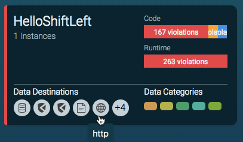
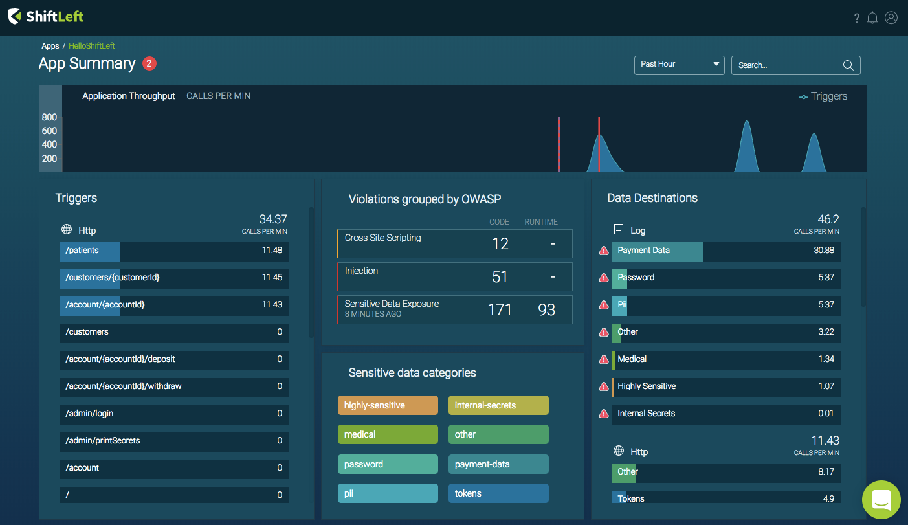

# JVM Based Environments

The ShiftLeft Protect Microagent is run with an application that has been analyzed by ShiftLeft. The Microagent is a lightweight agent that runs in-memory within the JVM of each application (in production or other environments such as staging, test, UAT) you want to monitor and protect using ShiftLeft. Once started, the Microagent periodically pushes runtime information to the proxy server and displays data and metrics in the [ShiftLeft Dashboard](../../using-dashboard/vulnerability-dashboard.md).

## Configuration Options

The ShiftLeft Microagent for Java runs out-of-the-box with default settings. See [Configuring the Microagent](configuring-the-microagent.md) for details on configuration options.


## Requirements

To run the Microagent, you must:

* Use a [supported 64-bit JVM](../../../introduction/requirements.md)
* Analyze the application using ShiftLeft Inspect.

## Required Parameters

If analysis has been performed as a separate step, then the `accessToken` and `sprId` parameters are required by the Microagent and must be passed using the `shiftleft.json` file that is generated during `analyze` by including it in the working directory with the app JAR file that you are deploying with the Microagent.

As an alternative to providing a `shiftleft.json` file, the `accessToken` and `sprId` can be provided via the environment variables `SHIFTLEFT_ACCESS_TOKEN` and `SHIFTLEFT_SPR_ID`, respectively.

### Access Token

The accessToken property represents the client access token that authorizes the Microagent to use ShiftLeft services.

### Security Profile for Runtime (SPR) ID

The SPR ID property identifies the [SPR](../../../policies/about-policy.md) to fetch from the proxy.

```json
{
  "accessToken": "${access-token-string}",
  "sprId": "${sprd-id}"
}
```

> **Important**. The required parameters `accessToken` and `sprId` must be passed using `shiftleft.json`. They cannot be passed using Java properties or environment variables. In addition, the `shiftleft.json` file must be located in the project directory where the application binary is located when you deploy the app with the Microagent. Alternatively, you can use the `SHIFTLEFT_CONFIG` environment variable to pass in the path to the `shiftleft.json` file.
>
> Example:
>
> `$ SHIFTLEFT_CONFIG=/home/myhome/shiftLeftFiles/shiftleft.json sl run -- <....>`

The `sprId` is a string containing three main parts: organization ID, application name, and commit hash. For example:

```
"sprId": "sl/418a892e-32fe-4d6e-b0cd-a44c24026b7a/org.springframework-my-rest-service-jar/f0e2bafa21a5790b1d70f6309189de6a1c888e16/baseline"
```

If you are using a SCM system such as Git, when you reanalyze the app after changing the code the commit hash changes, indicating a new version of the app is built. In this case you must redeploy the app with the Microagent using the updated `shiftleft.json` file. 

## Analyzing the Application

Before running the Microagent, analysis of the target application using ShiftLeft Inspect must be performed. This allows ShiftLeft Protect to generate instrumentation custom tailored to the specific version of the application.

Analysis can be performed either as a separate step, allowing installation in a build / Continuous Integration (CI) environment, or in the same command used to run ShiftLeft Protect.

### Analyzing as a Separate Step

When you analyze your application as a seperate step before using ShiftLeft Protect, you must include the `shiftleft.json` file (generated by ShiftLeft Inspect) with the target application you are deploying. Doing so allows the Microagent to associate the application to be run with the analysis.

Refer to [Analyzing Applications](../../../using-inspect-protect/inspect/analyzing-applications.md) for information on using ShiftLeft Inspect to analyze your application.

#### The `shiftleft.json` File

The `shiftleft.json` file generated by ShiftLeft Inspect contains the Access Token and SPR ID. These required parameters  must be passed to the Microagent.

By default, the Microagent expects the `shiftleft.json` file to be in the working directory from which you run your  application. If you are running the application in a different environment different, copy `shiftleft.json` to the working directory of that environment. 

Alternatively you can set the `SHIFTLEFT_CONFIG` environment variable to point to the path of the `shiftleft.json` file. For example

```bash
export SHIFTLEFT_CONFIG=/path/to/shiftleft.json
```

### Analyzing as Part of Running ShiftLeft Protect

Before using ShiftLeft Protect, make sure you are  authenticated to your ShiftLeft tenant using `sl auth` (see [Authenticating with ShiftLeft](../../using-cli/authenticating.md)).

The first time you analyze your application as part of running ShiftLeft Protect, it may take a bit of time. Subsequent runs, with the same version of the application, starts immediately since the analysis has already been done.

To perform analysis and run ShiftLeft Protect, use

```
sl run [--analyze <file.jar> --app myapp] -- <command>` 
```

For example:

```bash
sl run --analyze <file.jar> --app hello-shiftleft -- java -jar target/hello-shiftleft-0.0.1.jar
```

or

```bash
sl run -- sbt run
```

ShiftLeft checks the ShiftLeft server to determine whether analysis of this version of the application has already been performed. If not, ShiftLeft performs analysis in the cloud and waits for it to completed, then runs the application with the Microagent installed. 

Note that, this command also:

* Downloads the latest version of the Microagent, if that version isn't being used to monitor the application.

* Instructs the JVM to load the Microagent, using the specific environment variable set.

* Connects the Microagent to the ShiftLeft Proxy server to fetch the Security Profile for Runtime (SPR), generated by ShiftLeft Inspect as part of the analysis.

The `sl run` process is a wrapper around the target Java application process. It spawns the target application process as a child. When you deploy your application using `sl run`, you see two processes: the parent (`sl run`) and the child (application).

#### Using the -javaagent JVM Flag

If wrapping your application command line with `sl run` is not an option for you, then it is possible to instruct the JVM to load the Microagent by using the Java flag `-javaagent:<path-to-microagent-jar>`.

Note that passing the `javaagent` flag directly skips the Microagent's automatic update mechanism. In this situation, it is strongly recommend to use the command

```bash
sl update java-agent
```

Make sure that every time before starting your application, you have the latest version of the Microagent. Use the `~/.shiftleft/sl-microagent-latest.jar` symlink, to point to the latest downloaded version of the  Microagent. For example

```bash
# Optionally analyze app (if not analyzed before)
sl analyze --wait --app example-app exampleapp.jar
# Auto-update ShiftLeft Microagent.
sl update java-agent
# Run application with ShiftLeft Microagent.
java -javaagent:~/.shiftleft/sl-microagent-latest.jar -jar exampleapp.jar
```

## Verifying Microagent Connectivity

There are various ways to confirm that the Microagent is running.

### Dashboard Confirmation

As shown below, when the microagent is connected you will see this reflected in the **App Card** as "X Instances." If you don't see this, check the microagent command output.



In addition, runtime metrics and throughput data will appear at the **App Summary** screen for a selected application. For example:



### Process verification

The `sl run` command is a wrapper around the target Java application process. The `sl run` process spawns the target application process as a child process. So, when you deploy your application using `sl run`, you will see two Java processes: the parent `sl run` process and the child `application process`.

### Microagent output: Successful connectivity

When you run the microagent and it connects to the ShiftLeft Proxy server, you will see a success message similar to the following in the microagent output:

```
- ------------------------------
<< ShiftLeft Microagent (0.4.0)
- ------------------------------
<< 2018-02-05 11:20:01.257 INFO 1 Starting ShiftLeft Microagent...
<< 2018-02-05 11:20:01.354 INFO 6 Connecting to ShiftLeft Proxy server at agentproxy.shiftleft.io:443 (TLS enabled. ShiftLeft Proxy certificate validated via root CAs)
<< 2018-02-05 11:20:03.415 INFO 6 Requesting application SPR (non-strict mode)
<< 2018-02-05 11:20:05.205 INFO 9 Obtained SPR
```
