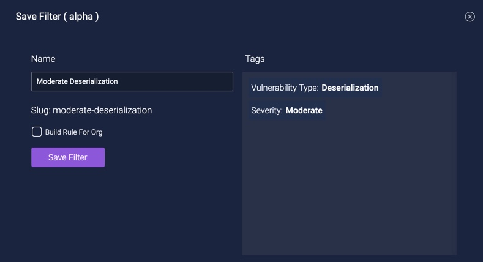

# Filtering Analysis Results

From the [Vulnerabilities Dashboard](vulnerability-dashboard.md), instead of scrolling through a list of analysis results, you can more quickly find vulnerabilities of interest by filtering using multiple criteria. Filters can also be saved and reused, and as the basis for a build rule. You can

* [Create a filter](#creating-a-filter)
* [Save a filter (alpha)](#saving-a-filter)
* [Choose a filter](#choosing-a-filter)

## Creating a Filter

Create a filter using one or more of the following criteria categories:

* Severity 
* Vulnerability Type
* OWASP Categories
* SAN Top 25

Within a category, you can specify an OR condition, and across categories the AND condition. For example, the filter

searches for all Critical vulnerabilities that are of the type Sensitive Data Leak **or** Sensitive Data Write.

**To create a filter**:

1. From your application's [Vulnerabilities Dashboard](../using-dashboard/vulnerability-dashboard.md), click in the **Search and apply filters** field.

   

2. From the drop-down menu, choose the criteria you want. The criteria is shown in the field. 
   Repeat this step to select multiple criteria **from the same category** as part of an OR condition.
   
3. To filter on additional criteria, from the drop-down menu choose the criteria you want. The criteria is shown in the field. This criteria becomes the AND condition to the previously selected criteria.
   Repeat this step to select additional criteria **from the same category** as part of an OR condition, or from other categories as part of an AND condition.
   
4. To delete a filter's criteria, click on the criteria's x in the field.

   

## Saving a Filter

Filters can be saved for future and repeated use. You can also use a saved filter as a [build rule to automatically fail a build in your CI-CD pipeline based on ShiftLeft Inspect's results](../inspect/fail-build.md).

**To save a filter**:

1. [Create a filter](#creating-a-filter).

2. Click on the Filter Saver icon in the **Search and apply filters** field.

    
    
3. In the resulting dialog, enter the filter's name. 

    
    
    The filter's Slug name is generated automatically and displayed. You can copy and use this Slug name when, for example, using the ShiftLeft API.
    
4. To use the filter as a build rule to tag a build in your CI-CD pipeline based on ShiftLeft Inspect's code analysis results, check **Build Rule for Org**.

5. Click **Save Filter**.

6. The saved filter is now listed in the drop-down menu of the **Search and apply filters** field.

    

## Choosing a Filter

You can switch between vulnerability views by choosing a saved filter.

**To choose a filter**:

1. From your application's [Vulnerabilities Dashboard](../using-workflow/vulnerability-dashboard.md), click in the **Search and apply filters** field.

2. From the drop-down menu, select the filter you want from the **Saved Filters** section. 

   
