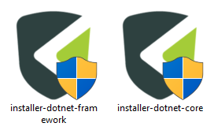
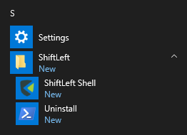
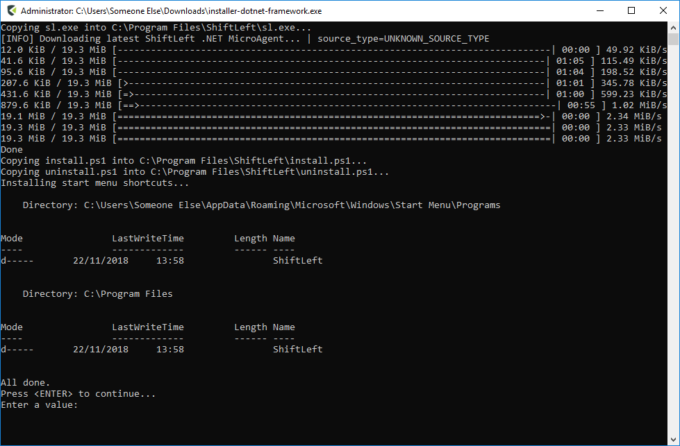

# Windows Installer

Installation on Windows for ShiftLeft tools (`sl` and .NET microagent) may be done using the installer available from the website.

## Installing

Use [this installer](https://cdn.shiftleft.io/download/installer-dotnet-framework-latest-windows-x64.zip) for .NET Framework installations or [this installer](https://cdn.shiftleft.io/download/installer-dotnet-core-latest-windows-x64.zip) for .NET Core installations. For ShiftLeft Protect, the installer bundles all dependencies into a single downloadable file, enabling  the installer to run offline (without connecting to the Internet).

Simply unpack the downloaded archive and an executable will appear.

The choice between .NET Core and .NET Framework is a setting specific to the .NET microagent only, we provide two executables with different defaults for ease of installation.

The installer requires a user with administrator privileges. It will copy `sl.exe` into the global programs directory (specifically `%ProgramFiles%\ShiftLeft`), create a start menu entry with a shortcut to open a shell with `sl.exe` in its path (the folder will be called `ShiftLeft` too), as well as an uninstall shortcut; the .NET microagent will be separately installed into `C:\shiftleftDotNetAgent`.

In case the installer is run from the command line the flag `--no-prompt` may be added to skip the prompt waiting for user input that's usually there to allow users to read the installer output when running it without a terminal.

At this time the installer can simply be executed by double-clicking and confirming when the dialog for elevated privileges pops up afterwards.

It will print its output on a terminal window; once done, pressing `Enter` again or closing the window will finish the installer.

### Options

The installer binary has a few command line options that modify its default behaviour:

- `--dotnet-core` / `--dotnet-framework` will select the proper setup for either .NET Core or .NET Framework applications for the agent.  Each downloaded installer will default to one of the two as indicated in the filename.
- `--no-prompt` will disable any prompts for non-interactive usage.
- `--install-directory` sets the installation directory, which defaults to `ShiftLeft` in the normal Windows programs folder.
- `--start-menu-entries` sets the directory for any start menu items to be created.  If empty, this will not install them.  Defaults to `ShiftLeft` in the top level of the start menu.
- `--sl-home` sets the home directory for any ShiftLeft tools.  This directory will be created and will store any downloaded binaries and configuration files.  Defaults to `.shiftleft` in the users own home directory.

All the directories will be stored in the registry and then similarly when running the uninstaller.

## Uninstalling

You uninstall ShiftLeft tools by double-clicking the Start menu command for the uninstaller. You are prompted to confirm elevated privileges.

Once confirmed (with `Enter`, and then `Y` at the second prompt to also uninstall ShiftLeft Protect for .NET), the uninstaller removes the installation. To abort the uninstall process, press `Ctrl-C` or close the window.

The window remains open until you press `Enter` or close the window.

### Options

Use the following command line options to modify uninstaller default behaviour:

- **`--no-prompt`**. Disables any prompts for non-interactive usage.
- **`--install-directory`**. Specifies the installation directory.
- **`--start-menu-entries`**. Specifies the start menu directory.
- **`--sl-home`**. Specifies the home directory for ShiftLeft tools.

The default values are read from the registry after installation.  See above for a more detailed description of the flags on the installer binary.
