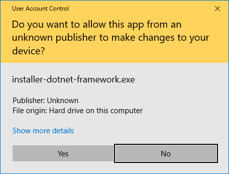
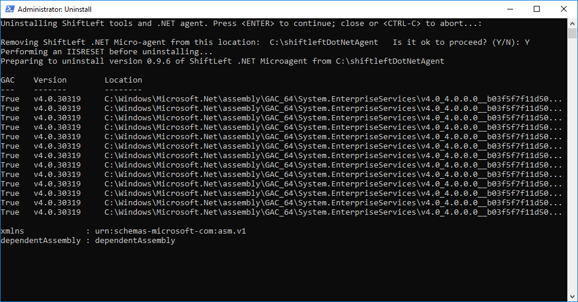

# Installing ShiftLeft Inspect and ShiftLeft Protect for Windows

For the Windows operating system, you can install ShiftLeft Inspect and ShiftLeft Protect (currently only for .NET Framework)  using the installers provided by ShiftLeft. Information is available on both [installing](#installing) and [uninstalling](#uninstalling) the ShiftLeft products.

The following installers are provided:

* [.NET Framework](https://cdn.shiftleft.io/download/installer-dotnet-framework-latest-windows-x64.zip) 
* [.NET Core](https://cdn.shiftleft.io/download/installer-dotnet-core-latest-windows-x64.zip) (only for ShiftLeft Inspect)

Note that the Windows installers require a user with administrator privileges.

## Installing

1. Download the appropriate installer.

2. Unpack the downloaded archive.

   

   An executable appears. 
   
   For ShiftLeft Protect, the installer bundles all dependencies into a single downloadable file, enabling the installer to run offline (without connecting to the Internet).
   
3. Double-click on the executable to start the installer. 

4. Using the resulting prompt, confirm elevated privileges.

   

   The installer copies `sl.exe` into the global programs directory (specifically `%ProgramFiles%\ShiftLeft`), creates a Start menu entry with a shortcut to open a shell with `sl.exe` in its path (the folder is called `ShiftLeft`), and an uninstall shortcut. ShiftLeft Protect for .NET Framework is separately installed into `C:\shiftleftDotNetAgent`.

   

  The installer prints its output on a terminal window; once done, pressing `Enter` or closing the window finishes the installation process.

   

### Installation Options

The installer binary has the following command line options to modify its default behavior:

- `--no-prompt`  Disables prompts for non-interactive usage if you are running the installer from the command line.
- `--install-directory`  Specifies the installation directory; the default is `ShiftLeft` in the normal Windows Programs folder.
- `--start-menu-entries`  Sets the directory for the location of created Start menu items. Defaults to `ShiftLeft` in the top level of the Start menu.  If empty, no Start menu items are created. 
- `--sl-home`  Identifies the home directory for ShiftLeft products.  This directory is created as part of the installation process, and stores any downloaded binaries and configuration files.  Defaults to `.shiftleft` in your Home directory.
- `--no-dotnet-agent` Installs just ShiftLeft Inspect (i.e. `sl.exe`) and not ShiftLeft Protect.

All directories are stored in the registry.

## Uninstalling

You uninstall ShiftLeft Inspect and ShiftLeft Protect by double-clicking the Start menu Uninstall command. You are prompted to confirm elevated privileges.

Once confirmed (by pressing `Enter`, and then `Y` at the second prompt if you also want to uninstall ShiftLeft Protect for .NET Framework), the uninstaller removes the installation. To abort the uninstall process, press `Ctrl-C` or close the terminal window.

The terminal window remains open until you press `Enter` or close the window.

### Uninstallation Options

Use the following command line options to modify uninstaller default behavior:

- **`--no-prompt`**.  Disables any prompts for non-interactive usage.
- **`--install-directory`**.  Specifies the installation directory.
- **`--start-menu-entries`**.  Identifies the Start menu directory.
- **`--sl-home`**.  Sets the Home directory for ShiftLeft products.

The default values are read from the registry after installation.  
