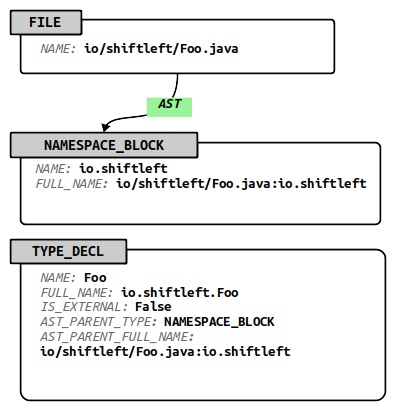
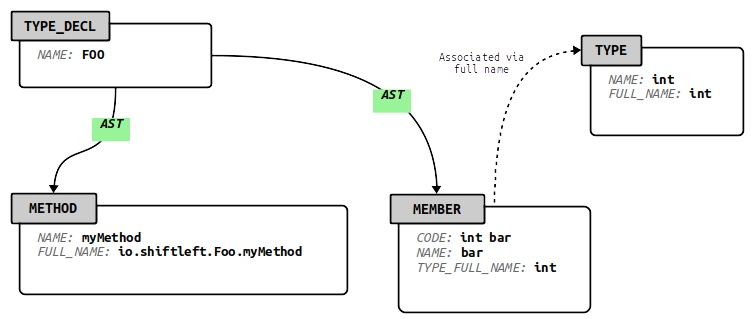
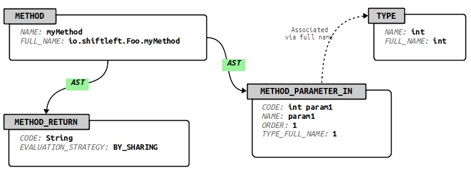
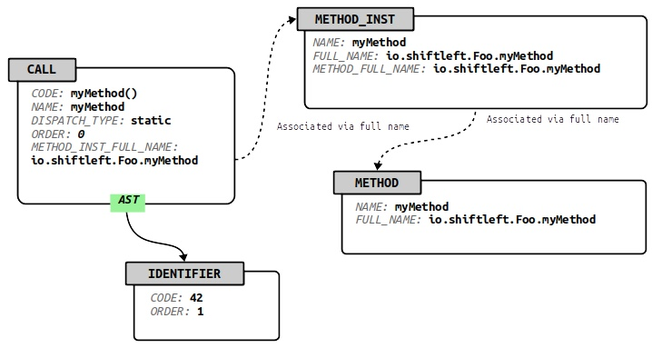

# Deep-Dive: The Code Property Graph (CPG)

All ShiftLeft solutions leverage the CPG. The CPG is an extensible and language-agnostic
representation of program code designed for incremental and
distributed code analysis. It provides, and stores, an intermediate representation of your code along with analysis results. 

In a single graph, the CPG provides multi-layered representation of each code version, including the various levels of abstraction. The unique insights from the CPG provide all ShiftLeft solutions with granular detail and a deep understanding of data flows.

For additional information, refer to  

* [Understanding the CPG](../../introduction/understanding-cpg.md)
* [Creating the CPG](create-cpg.md) 
* [Working with CPGs](working-with-cpg.md)

## CPG Base Schema

The CPG is a directed, edge-labeled, attributed
multigraph, or property graph for short. A property graph
is the generic data structure underlying many contemporary graph
databases. As a result, data representations based on property graphs
are immediately amenable to graph database technologies. 

Property graphs alone are comparable in generality to hash tables and
linked lists. To tailor them towards storing, transmitting, and
analyzing code, the main challenge is to specify a suitable graph
schema. In particular, a schema must define the valid node and edge
types, node and edge keys, together with each of their domains.
Finally, a schema puts constraints on the types of edges that may
connect nodes, depending on their type(s).

The base schema provides the minimum requirements all valid CPGs must satisfy.
The base specification is concerned with three aspects of the program:

* Program structure
* Type declarations 
* Method declarations 

where a declaration comprises a formal signature, along with defining content such as a
method body for methods or a literal value in the definition of a
variable. 

### Base Schema Specification

The base schema of the CPG is specified in the JSON file `base.json`. 
The file contains a JSON object with the following members:

* `nodeKeys/edgeKeys`. List of all valid node/edge attributes. Each list element is an object specifying the attribute's ID, name, its type, and a comment.

* `nodeTypes/edgeTypes`. List of all node/edge types (i.e. edge lables in the original property graph definition), where each node/edge type is given by an object that specifies an ID, name,keys, comment, and, for node types (each note is required to have a mandatory note type, represented by a node attribute), valid outgoing edge types.

There are a total of 20 node types across five categories:

Category          | Names
------------------| -------------------------------------------------------------------------------------------------
Program structure | FILE, NAMESPACE_BLOCK
Type declarations | TYPE_DECL, TYPE_PARAMETER, MEMBER, TYPE, TYPE_ARGUMENT
Method header     | METHOD, METHOD_PARAMETER_IN, METHOD_RETURN, LOCAL, BLOCK, MODIFIER
Method body       | LITERAL, IDENTIFIER, CALL, RETURN, METHOD_INST, METHOD_REF
Meta data         | META_DATA

There are a total of eight edge types:

Name | Usage
-----|----------------------------------------------------------------
AST  | Syntax tree edge - structure
CFG  | Control flow edge - execution order and conditions
REF  | Reference edge - references to type/method/identifier declarations
EVAL_TYPE | Type edge - attach known types to expressions
CALL | Method invocation edge - caller/callee relationship
VTABLE | Virtual method table edge - represents vtables
INHERITS_FROM | Type inheritance edge - models OOP inheritance
BINDS_TO | Binding edge - provides type parameters

There are a total of 17 node keys across three categories:

Category       | Names
---------------| ---------------------------------------------------------------------------------------------------------------------------------
Declarations   | NAME, FULL_NAME, IS_EXTERNAL
Method header  | SIGNATURE, MODIFIER_TYPE |
Method body    | PARSER_TYPE_NAME, ORDER, CODE, DISPATCH_TYPE, EVALUATION_STRATEGY,LINE_NUMBER, LINE_NUMBER_END, COLUMN_NUMBER,COLUMN_NUMBER_END, ARGUMENT_INDEX
Meta data      | LANGUAGE, VERSION

There is zero edge keys in the base specification.

Notice the deviation from the JSON standard by allowing inline comments. Any
line for which the first two non-whitespace characters are equal to
`/`, are treated as comments and need to be stripped prior to passing
the definitions to standard JSON parsers.

### Program Structure

Node types: FILE, NAMESPACE_BLOCK

Program structure is concerned with the organization of programs into
files, namespaces, and packages. A program is composed of zero or more
files (type FILE), each of which contains one or more namespace blocks
(type NAMESPACE_BLOCK). Namespace blocks contain type and method
declarations (type TYPE_DECL and METHOD). Abstract syntax tree (AST) edges must exist
from files to namespace blocks. Structural elements below namespace blocks
are not connected to their AST parents by an edge. Instead the AST_PARENT_TYPE
and AST_PARENT_FULL_NAME properties are used to inform the backend about the
AST relation of methods (type METHOD) and type declarations (type TYPE_DECL) to
their parents. The property FULL_NAME thereby must be a unique identifier for
the three node types METHOD, TYPE_DECL and NAMESPACE_BLOCK. This figure shows how a
Java class definition is represented in a CPG.

The concept of namespace blocks correspond to the equivalent
concepts in the C++ programming language, where namespace blocks are
used to place declarations into a namespace. Other languages, e.g.,
Java or Python, do not provide the same type of namespace blocks. However, they allow
package declarations at the start of source files that serve the
purpose of placing all remaining declarations of the source file into
a namespace. Package declarations are translated into corresponding
namespace blocks for these languages. So the name of a namespace block is
the complete namespace of all the elements within the block and the
full name of a namespace block is a unique identifier for a specific block.
E.g. for Java it would be enough to prefix the file name to the namespace
because there is only one namespace describing package statement per file.

### Type Declarations

Node types: TYPE_DECL, TYPE_PARAMETER, MEMBER, TYPE, TYPE_ARGUMENT

Language constructs are expressed that declare types via *type declarations*. Examples of these constructs include classes, interfaces, structures, and
enumerations. A type declaration consists of a name, an optional list
for type parameters, member variables, and methods. Finally,
inheritance relations with other types may be encoded in *type declarations*.

In the CPG, each type declaration is represented by a
designated type-declaration node (type TYPE_DECL), with at least a
full-name attribute. Member variables (type MEMBER), method declarations
(type METHOD), and type parameters (type TYPE_PARAMETER) are
connected to the type declaration via AST edges, originating at the
type declaration. Inheritance relations are expressed via
INHERITS_FROM edges to zero or more other type declarations (type
TYPE_DECL), which indicate that the source type declaration inherits
from the destination declaration.

Usage of a type, for example in the declaration of a variable, is indicated
by a type node (type TYPE). The type node is connected to the
corresponding type declaration via a reference edge (type REF), and to
type arguments via AST edges (type AST). Finally, type-argument nodes
are connected to type parameters via binding edges (type BINDS_TO).

### Method Declarations

A method declaration consists of a method header and a method body,
where the declaration is a CPG representation of the method's input
and output parameters, and the method body contains the
instructions/statements of the method.

#### Method Header

Node types: METHOD, METHOD_PARAMETER_IN, METHOD_RETURN, LOCAL, BLOCK, MODIFIER

The term *method* is used in object-oriented programming languages to
refer to a procedure that is associated with a class. The term is used here 
in a broader sense to refer to any named block of code. This code may
or may not be defined to be associated with a type. The method
consists of a method header and a method body. The method header is
given by a name, a formal return parameter, and finally, a list of
formal input parameters and corresponding output parameters. The
method body is simply a block of statements as illustrated below.

In the CPG, each method is represented by a designated
method node (type METHOD) that contains the method name in
particular. Methods are connected to their method input parameters
(type METHOD_PARAMETER_IN), return parameter (type METHOD_RETURN),
modifiers (type MODIFIER), and locals (type LOCAL) via AST edges.
Finally, the method node is connected to a block node (type BLOCK),
which represents the method body. 

#### Method Body

Node types: LITERAL, IDENTIFIER, CALL, RETURN, METHOD_INST, METHOD_REF

Method bodies contain the method implementation, given by the
operations the method carries out. Method bodies are represented as
control flow graphs over method invocations, a representation used to provide a common ground for the instruction, statement,
and expression concepts used across machine-level and high-level
programming languages. The core elements of the method body
representation are thus method invocations ("calls") and
control-flow edges.

In the CPG, a method invocation is represented by a
designated call node (type CALL). Arguments are either identifiers
(type IDENTIFIER), literals (type LITERAL), other calls (type CALL),
or method references (type METHOD_REF). Each argument has an argument
index property (type ARGUMENT_INDEX) to indicate with which parameter it is
associated. Calls are connected to their arguments through outgoing
AST edges, and are associated with their corresponding method-instance
(type METHOD_INST) via their METHOD_INST_FULL_NAME property.
Method-instance nodes represent concrete instantiations of method
declarations, that is, method declarations along with type parameters.
Method nodes are connected to type arguments (type TYPE_ARGUMENT) via
AST edges, and are associated with their corresponding method via their
METHOD_FULL_NAME property.

In addition to identifiers, literals, and calls, method
references (type METHOD_REF) are allowed to represent locations in the code where a
method is not called, but referenced, as is the case for programming
languages where methods are first-class citizens. Method references
are connected to method instances via reference edges (type REF).

Return nodes (type RETURN) are created for each location in
the method body where control is returned to the caller. Unconditional
control flow edges are created from preceding calls to return nodes.
All remaining nodes are connected via control flow edges (type
CFG) according to execution order and constraints. The method node is
treated as the entry node of the control flow graph. Finally, a designated block node (type BLOCK) is created for the method body, and creates outgoing AST edges to all expressions that correspond to statements.

#### Background on the Method Body Representation

In machine-level languages, procedure bodies are defined by
instructions and connected by control flow edges to form a control flow
graph. Each instruction represents an operation carried out by the
machine, which can modify the program state. In contrast, higher-level
languages (C and above) typically eliminate the instruction concept in
favor of statements. As for instructions, statements can modify the
program state. They differ from instructions in that they can consist
of multiple expressions. Expressions are anonymous blocks of code that
receive input and produce an output value upon evaluation. Inputs to
an expression can be literals and identifiers, but they may also be
other expressions. In fact, the semantics of statements can be fully
encoded via expression trees, and control flow edges attached to
the roots of these trees, to represent the statement's control flow
semantics.

The ability of a statement to represent several expressions allows for
concise program formulation. However, it presents challenges to
program analysis. While it is possible to create a control flow graph
by introducing control flow edges between statements, this graph does
not encode the intra-statement control flow. Fortunately, the tree combined
with disambiguation rules of the programming language fully encodes the
evaluation order of expressions within a statement. This allows 
unambiguously representation of their evaluation order with control flow edges.

Expressions consist of method evaluations and applications of
operators provided by the language. By expressing operators as methods
and allowing methods to receive the return values of other methods as
input, all expressions can be represented as method invocations. A program representation for the method body is thus produced, which consists of method invocations connected by control flow edges.

### Meta Data Block

A metadata block (type META_DATA) is included in CPG 
with two fields: a language field (key LANGUAGE) to indicate the
programming language from which the graph was generated, and a version field
(key VERSION) holding the specification version. Both fields are
free-text strings.
