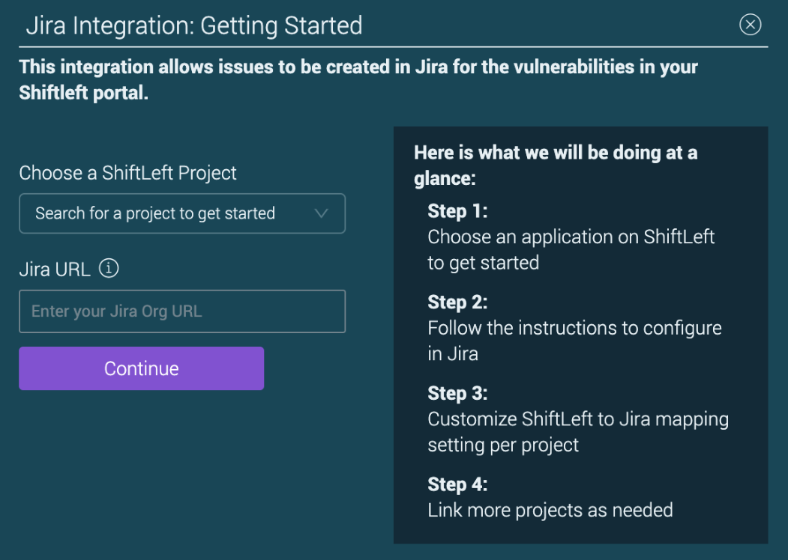
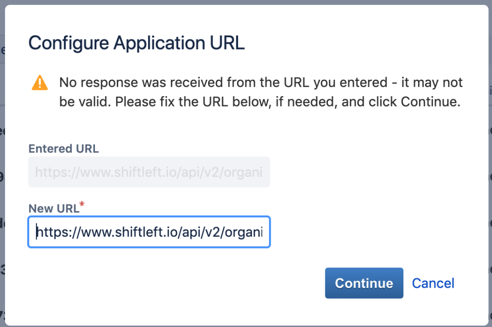

# Enabling Jira Integration

Integrate Jira with your ShiftLeft account to create tickets in Jira for the Vulnerabilities in your ShiftLeft dashboard.

## Prerequisites

- User enabling Jira should be in the *jira-administrators* group
- At least one project in your Jira account that ShiftLeft can create tickets in 
- At least one application in the ShiftLeft dashboard

## Installation

### Getting Started

- Login into your ShiftLeft account
- Click on the gear icon located in the top right section (Image 1)

Image 1: Opening integrations page

- Select Jira from the Available Integrations table by clicking on the + icon (Image 2)

Image 2: Selecting Jira from available integrations

- From the dropdown, choose your *ShiftLeft Project* that you want Jira Integration enabled on
- Enter your *Jira Org URL* to create a secure connection (It should look like: https://shiftleft.atlassian.net)
- Click *Continue* to further configuration

Image 3: Jira integration - Getting started

### Configuration

**Step 1**

Image 4: Linking ShiftLeft project to Jira

- In a new tab, open *Configure Application Links* in your Jira account (It should look like: https://shiftleft.atlassian.net/plugins/servlet/applinks/listApplicationLinks)
- Copy the *ShiftLeft Application URL* and *Create new link* (as shown in Image 5)

Image 5: Creating new link in Jira

- If you see any “No response…” message, please ignore, the integration will still work. Click *Continue* (as shown in Image 6)

Image 6: Random warning in Jira

** Step 2**

- Fill in the configuration fields using the corresponding values from the ShiftLeft Configuration screen to finalize the connection (as shown in image 7). 
- Check the box that says *Create incoming link* 
- Click *Continue*

Image 7: Linking ShiftLeft generated information in Jira

**Step 3**

- Fill the final 3 fields and click *Continue*
- You should see a confirmation dialogue confirming the successful Application Link creation (as shown in Image 8)

Image 8: Successfully created application link

- Proceed to ShiftLeft dashboard and click *Continue* 
- Please *Allow* ShiftLeft to have read and write access to your Jira project (Note: Clicking *Deny* will disrupt the integration flow and you might need to contact ShiftLeft support to enable again)

Image 9: Allowing read and write access

### Enabling Two-way Integration

**Note:** We cannot fetch your existing Jira issues into ShiftLeft dashboard. Once a vulnerability is pushed from the ShiftLeft Dashboard to your Jira, we can fetch any state changes of that particular ticket and update it in ShiftLeft Dashboard.

- Select a project in your Jira where ShiftLeft should create tickets

- Select your Default priority and Default state settings

- - Default priority settings: Defines what should be the priority of the ticket in Jira based on the severity defined by ShiftLeft
  - Default state settings: Defines how ShiftLeft should ShiftLeft treat any state change for the tickets in Jira

- Select how you want the ticket to show up in your Jira (ex: Bug, Task, Epic, etc) 

- Click *Continue* to Save and Finish configuration (You can change these settings in the Manage Integration section later)

Image 10: Mapping settings

### Enabling on Other Projects

- Click on the gear icon in the Configured Integrations (Image 11)
- Click on the + icon on the new ShiftLeft project you want to enable Jira integration
- Please Allow ShiftLeft to have read and write access to you Jira project
- Enable Two-way Integration with custom options as explained above 

Image 11: Manage integration

Image 12: Add more projects

## Creating Jira Tickets from the ShiftLeft Dashboard

- Once Jira Integration is enabled you will see a *Send to Jira* button for each Vulnerability
- Click that to file a ticket in your Jira environment
- A confirmation state will also link Jira ticket to the Vulnerability
- Status changes in Jira will automatically be reflected on the linked vulnerabilities on the ShiftLeft Dashboard

Image 13: Jira CTA in vulnerability details 

Image 14: Jira linked in vulnerability details

Image 15: Status update in Jira

Image 16: Status update on vulnerability details page
